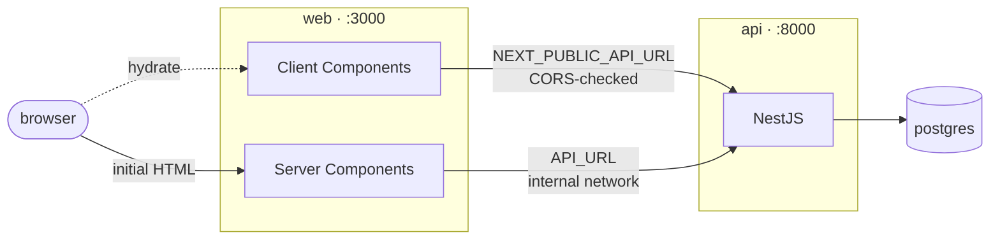
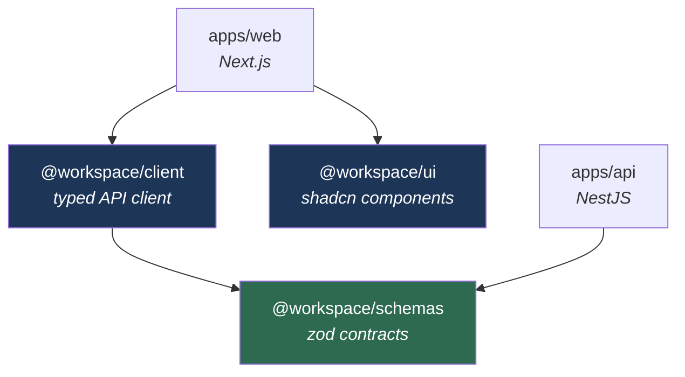

<div align="center">

# workspace

**Turborepo monorepo — NestJS API, Next.js web app, shared UI and contracts.**

Containerised end to end. Two portable images, no vendor lock-in.

<br>

[](https://bun.sh)
[](https://turborepo.com)
[](https://nextjs.org)
[](https://nestjs.com)
[](https://nodejs.org)
[](https://docker.com)

</div>

---

## Quick start

```bash
bun install
bun run dev
```

Web on [localhost:3000](http://localhost:3000), API on [localhost:8000](http://localhost:8000).

**Or run the whole stack in containers** — Postgres included, nothing to install:

```bash
cp .env.example .env
docker compose up -d --build
```

```bash
curl localhost:3000/healthz
curl localhost:8000/health
```

---

## How it fits together

The browser calls the API directly at `NEXT_PUBLIC_API_URL`. Server Components use
`API_URL` instead, so server-side traffic can stay on an internal network.



> [!IMPORTANT]
> Every API route is reachable from the internet. There is no frontend hop to hide
> behind — authentication and rate limiting belong in the API itself, and
> `ALLOWED_ORIGINS` is what decides who may call it.

`NEXT_PUBLIC_API_URL` is inlined into the client bundle at build time, so the web image
is environment-specific: pass it as a `--build-arg` and build once per environment.

---

## Workspace



`@workspace/schemas` is the single source of truth for the response envelope, error
codes and validation messages — both sides import it, so a contract change breaks the
build rather than production.

```
apps/
  api/                      NestJS API · Dockerfile · README
  web/                      Next.js app · Dockerfile · README
    messages/<locale>/      Translation catalogues, one JSON per namespace
    project.inlang/         inlang project settings
    src/
      app/                  App Router
      components/
      lib/paraglide/        Generated, git-ignored, never edited by hand
      proxy.ts              Sets the locale cookie
packages/
  ui/                       Shared shadcn/ui library (@workspace/ui)
  client/                   Typed API client (@workspace/client) · README
  schemas/                  Shared zod contracts (@workspace/schemas) · README
  typescript-config/        Shared tsconfig bases
compose.yaml                db + api + web
```

---

## Stack

| Tool | Version | Notes |
| --- | --- | --- |
| Bun | 1.4.0 | Package manager + script runner |
| Turborepo | 2.10.x | Task orchestration + caching |
| Next.js | 16.3.x | App Router, Turbopack, standalone output |
| NestJS | 12.x | Express platform, Drizzle, Pino |
| React | 19.2.x | RSC enabled |
| Node | 24 LTS | Runtime for both images (Active LTS → Apr 2028) |
| Tailwind CSS | 4.3.x | CSS-first config, no `tailwind.config.js` |
| shadcn/ui | CLI 4.x | `base-nova` style, Base UI primitives |
| Paraglide JS | 2.25.x | Compiler-based i18n |
| TanStack | Query 5 / Form 1 | Server state and forms |
| Zod | 4.5.x | Shared contracts across API and web |
| Biome | 2.5.x | Lint + format, replaces ESLint + Prettier |
| Vitest | 5.0.x | Test runner, one project per package |
| Testcontainers | 12.1.x | Throwaway Postgres for integration tests |
| PostgreSQL | 18 | Via Drizzle ORM |

---

## Commands

| Command | Does |
| --- | --- |
| `bun run dev` | All apps, watch mode |
| `bun run build` | Build everything |
| `bun run typecheck` | `tsc --noEmit` per package |
| `bun run test` | Unit tests per package (Vitest) |
| `bun run test:integration` | Integration tests — needs Docker |
| `bun run test:coverage` | Unit tests with a v8 coverage report |
| `bun run test:watch` | Vitest watch mode across the workspace |
| `bun run check` | Biome lint + format, read-only |
| `bun run check:fix` | Biome, write |
| `bun run ui:add <name>` | Add a shadcn component into `packages/ui` |

Database commands live in `apps/api` — see [its README](apps/api/README.md#database).

---

## Testing

[Vitest](https://vitest.dev) runs as one project per package. The root
`vitest.config.ts` discovers them by glob, so `vitest` at the root runs everything and
Turborepo caches each package's suite independently.

To add tests to a package, give it a `vitest.config.ts` with a unique `name` and a
`test` script — the root config and `turbo test` pick it up with no further wiring:

```ts
// packages/<name>/vitest.config.ts
import { defineConfig } from "vitest/config"

export default defineConfig({
  test: {
    name: "<name>",
    root: import.meta.dirname,
    environment: "node",
    include: ["tests/unit/**/*.test.ts"],
  },
})
```

Suites that need a database add a second `vitest.integration.config.ts` and a
`test:integration` script. `@workspace/seed` is the worked example: unit tests drive
the engine through a recording executor, integration tests run against a throwaway
Postgres 18 container started by Testcontainers. See
[its README](packages/seed/README.md#testing).

`bun run test` never needs Docker. `bun run test:integration` does.

---

## Docs

| Document | Covers |
| --- | --- |
| [Architecture](docs/architecture.md) | Request flow, response envelope, the API client, conventions |
| [Database](docs/database.md) | Drizzle schema layout, migrations, the JSON seeder |
| [Deployment](docs/deployment.md) | Images, environment variables, health checks, gotchas |
| [Internationalisation](docs/i18n.md) | Paraglide on the web, `nestjs-i18n` on the API, shared message keys |
| [`apps/web`](apps/web/README.md) | Routing, data fetching, locale, theme and styling |
| [`apps/api`](apps/api/README.md) | Layers, validation, feature modules, data layer |
| [`@workspace/client`](packages/client/README.md) | Typed client, error union, TanStack Query factories |
| [`@workspace/schemas`](packages/schemas/README.md) | Envelope, error codes, pagination, validation keys |
