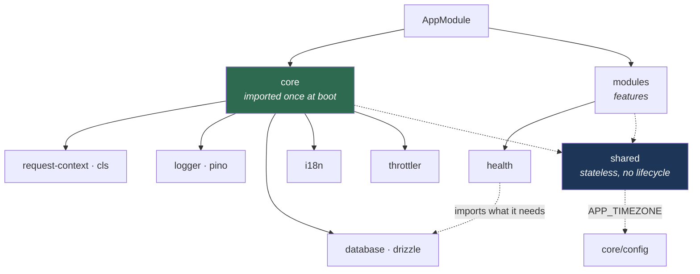

# api

NestJS 12 on the Express platform, with Drizzle, Pino and zod.

- [Layers](#layers)
- [Scripts](#scripts)
- [Configuration](#configuration)
- [Request pipeline](#request-pipeline)
- [Language](#language)
- [Validation](#validation)
- [Feature modules](#feature-modules)
- [Database](#database)
- [Testing](#testing)

---

## Layers

Three layers under `src/`, each reached through a path alias rather than long relative
paths.



```
src/
  main.ts
  app.module.ts
  app.controller.ts

  core/            imported once at boot; app-wide singletons
    config/        getEnv() (envalid), CORS, helmet, Swagger
    database/      drizzle + postgres.js: the connection and schema/
    i18n/          nestjs-i18n + the lang catalogues
    logger/        nestjs-pino, redaction, request-id correlation
    request-context/  nestjs-cls, the x-request-id header
    throttler/     rate limiting

  shared/          stateless; importable from anywhere
    decorators/    Swagger response decorators, @RawResponse, @ResponseMessage
    exceptions/    ApiException
    filters/       AllExceptionsFilter
    interceptors/  ResponseInterceptor
    pipes/         the zod validation pipe
    types/
    utils/         DateUtils, StrUtils, NumberUtils
    response.ts    the success/error envelope

  modules/         features
    health/
```

| Alias | Path |
| --- | --- |
| `@core`, `@core/*` | `src/core` |
| `@shared`, `@shared/*` | `src/shared` |
| `@modules/*` | `src/modules/*` |

```ts
import { successResponse, DateUtils } from "@shared"
import { getEnv } from "@core/config"
import { CoreModule } from "@core"
```

`nest build` plus `tsc-alias` rewrite these to relative paths, so nothing extra is
needed at runtime.

**The rule for the two non-feature layers:** `core` is what the app needs exactly once,
and `AppModule` imports it once. `shared` is stateless and carries no lifecycle, so
anything may import it freely. A feature never imports `CoreModule` — it imports the
specific module it needs (`DatabaseModule` for the connection) so its dependencies read
off its own file.

`shared/utils` does reach back into `@core/config` — `DateUtils` reads `APP_TIMEZONE`.
That is the one dependency crossing the layers, and it only goes one way.

There is no `libs/` directory. Nothing here is Nest-free enough for `apps/web` to
import, so it stays in the app — promote a directory to `packages/` once something
outside the API needs it.

---

## Scripts

```bash
bun run dev
bun run build
bun run start:prod
bun run typecheck
```

| Script | Does |
| --- | --- |
| `dev` | `nest start --watch` |
| `build` | `nest build`, then `tsc-alias` over `tsconfig.build.json` → `dist/` |
| `start:prod` | `node dist/main` |
| `db:generate` | Diff the schema into a migration under `db/migrations/` |
| `db:migrate` | Apply pending migrations |
| `db:check` | Verify migrations against the schema |
| `db:studio` | Drizzle Studio |
| `db:seed` | Apply JSON fixtures: `bun run db:seed local`. `--help` for flags |

Lint and format are Biome, run from the repo root: `bun run check:fix`.

---

## Configuration

Every variable is declared and validated in `src/core/config/env.ts` and read through
`getEnv()`. A malformed value fails at boot, not on the first request.

Copy `.env.example` to `.env` to start. `DATABASE_URL` is the only variable without a
development default — the app exits at boot without it.

Set `API_DOCS_ENABLED=true` to mount the Scalar API reference at `/docs`.

---

## Request pipeline

Nothing in a handler deals with envelopes, request ids or translation. That is all
wired globally in `CoreModule`.


**`ResponseInterceptor`** wraps whatever a handler returns in
`{ success, message, data }`, resolving the message through `nestjs-i18n`. Two opt-outs:

| Decorator | Effect |
| --- | --- |
| `@ResponseMessage("some.key")` | Use that catalogue key instead of `common.success` |
| `@RawResponse()` | Skip the envelope entirely — used by `HealthController`, whose Terminus body orchestrators already understand |

A handler that returns `successResponse(...)` itself is left alone.

**`AllExceptionsFilter`** catches everything, maps the status to an `ErrorCode`, and
resolves the message in the request language. On 5xx it attaches the request id to the
body and logs the error against it. On 5xx only, `API_DEBUG_ERRORS` also adds the
raw message and a stacktrace array — 4xx bodies never carry one.

Throw `ApiException` when you want to name the code yourself:

```ts
throw new ApiException(409, {
  code: errorCodes.conflict,
  messageKey: "message.users.email_taken",
})
```

---

## Language

Every envelope message — success, error and field error alike — is resolved in the
request language. Locales are `en` (fallback) and `ko`; catalogues live in
`src/core/i18n/lang/<locale>/`.

The language is resolved from four sources, first match wins:

| Order | Source | Example |
| --- | --- | --- |
| 1 | `?lang=` or `?locale=` query parameter | `GET /?lang=ko` |
| 2 | `x-lang` or `x-custom-lang` header | `x-lang: ko` |
| 3 | `Accept-Language` | `Accept-Language: ko-KR,ko;q=0.9` |
| 4 | fallback | `en` |

**Clients should send the header.** `@workspace/client` sets `x-lang` from its `locale`
option on every request, and both i18n headers are in the CORS allow-list, so a browser
can send them cross-origin.

The query parameter is the escape hatch: it wins over the header, and it works where a
header cannot be set — a link, a browser address bar, a Scalar "try it" call. Use it to
check a translation, not as the transport for a real client.

```bash
curl -H "x-lang: ko" http://localhost:8000/      # what a client does
curl "http://localhost:8000/?lang=ko"            # what you do by hand
```

A region tag falls back to its base locale (`ko-KR` → `ko`, `en-GB` → `en`), and an
unknown language falls through to `en` rather than erroring. The accepted names live in
`src/core/i18n/i18n.constants.ts` — add to them there and CORS picks the headers up
automatically.

---

## Validation

DTOs are zod schemas wrapped in `createZodDto` from `nestjs-zod`:

```ts
const CreateUserSchema = z.object({
  email: z.email(),
  age: z.number().int().min(18),
})

export class CreateUserDto extends createZodDto(CreateUserSchema) {}

@Post()
create(@Body() body: CreateUserDto) {
  return this.users.create(body)
}
```

The globally registered `CustomValidationPipe` parses the schema and, on failure,
returns `422` with a `{ field: [messages] }` map. Messages resolve against
`src/core/i18n/lang/<lang>/validation.json` in the request language; a message set on
the schema itself wins over the catalogue.

Schemas shared with the web carry `validation:`-prefixed keys instead of literal strings
— see [i18n](../../docs/i18n.md#shared-validation-messages).

---

## Feature modules

A feature owns everything it needs, in one directory:

```
src/modules/users/
  users.module.ts
  users.controller.ts
  users.service.ts
  users.repository.ts
  users.schema.ts
  dto/
    create-user.dto.ts
```

Persistence stays next to the feature that owns it — no central repository tree, so one
change touches one directory.

---

## Database

`src/core/database` holds the connection and the schema:

```
src/core/database/
  client.ts            createDatabaseClient() — pool, casing, shared types
  database.module.ts   the Nest provider under the DRIZZLE symbol
  schema/
    index.ts           barrel — what drizzle-kit and the typed client both read
    columns.ts         shared column builders (primaryId, timestamps)
```

```ts
@Module({ imports: [DatabaseModule] })
export class UsersModule {}

@Injectable()
export class UsersRepository {
  constructor(@Inject(DRIZZLE) private readonly db: DrizzleDatabase) {}
}
```

Unlike controllers and services, **tables do not live next to their feature.** The whole
data model is one directory, split one file per area and re-exported from
`schema/index.ts`. `drizzle-kit` generates from that barrel and `createDatabaseClient`
hands the same namespace to `drizzle()`, so the generator and the runtime client cannot
disagree about what exists.

Casing is `snake_case` in both, so TypeScript stays camelCase and Postgres stays
snake_case without per-column mapping. With `LOG_LEVEL=debug`, every statement is logged.
`DatabaseHealth` probes the connection for `GET /health`.

Everything else about the database is tooling and lives in `db/`, outside `src/`, so
`nest build` never compiles it into the runtime image:

```
db/
  migrations/    generated SQL
  fixtures/      seed data — base/ plus one directory per environment
  seeder/        the seed runner
```

Migrations, the JSON seeder and its directive language are documented in
[database](../../docs/database.md).

---

## Testing

```bash
bun run test              # unit — no Docker
bun run test:watch
bun run test:coverage
bun run test:integration  # needs Docker
```

Unit tests live in `tests/unit/`, mirroring `src/`. `tests/support/` holds the test
doubles and `tests/setup/unit.ts` fixes the environment every suite reads, so
`getEnv()` and `DateUtils` are deterministic.

Integration tests live in `tests/integration/` and drive the assembled app over real
HTTP against a throwaway Postgres 18 container. `setup/container.ts` is the global
setup: it starts the container, applies `db/migrations` with the Drizzle migrator, and
hands the connection string to each worker through `project.provide`. `setup/env.ts`
then writes it into `process.env` before any application module loads — `getEnv()`
reads the environment once at import and caches, so the order matters.

`support/app.ts` boots the app the way `main.ts` does — the global validation pipe,
CORS and helmet — and returns a supertest agent. It builds two apps: the real
`AppModule`, and a fixture app that pairs `CoreModule` with a controller defined in
`support/fixtures.controller.ts`. The fixture routes exist because the running API has
no endpoint that takes a body or fails on purpose, and the pipeline's interesting
behaviour — a 422 field map, a 500 with a request id, `@RawResponse`, `@ResponseMessage`
— cannot be reached without one.

What is covered: the response envelope, the error envelope and its status-to-code map,
validation in both body and query, all three language resolvers with their regional
fallbacks, request-id correlation from header to log to error body, rate limiting, and
the security headers. `THROTTLER_LIMIT` is raised in `setup/env.ts` so ordinary suites
never trip it; `throttler.test.ts` lowers it and imports the app dynamically, since the
module reads the value once at import.

There are no tests for `example_categories` and `example_items`. Those tables are
scaffolding, and exercising them would mostly assert that Drizzle and Postgres work.
`health.test.ts` already proves the real thing: the app resolves `DRIZZLE`, connects,
and the indicator reports up. Write database tests when there are tables this service
actually owns.

**The config is `vitest.config.mts`, not `.ts`.** Two reasons, both forced:

Vitest transpiles with esbuild, which [does not implement](https://esbuild.github.io/content-types/#no-type-system)
`emitDecoratorMetadata`. Without it Nest sees no `design:paramtypes` and cannot resolve
a constructor's dependencies, so `Test.createTestingModule` fails on every provider.
The config runs `unplugin-swc` instead, which does emit that metadata. `tests/unit/harness.test.ts`
asserts this still works, so a regression in the toolchain fails loudly rather than
looking like a broken provider.

This package emits CommonJS, so an ESM config file needs the `.mts` extension. The root
`vitest.config.ts` globs both extensions.

Two things follow from the CommonJS output, and both bite when writing a test:

| Doing this | Use |
| --- | --- |
| Resolving a path in a test | `__dirname` — `import.meta` is a compile error here |
| `await import()` of a source file | A relative specifier ending in `.js` — a path alias does not typecheck |

Prefer plain constructors over `Test.createTestingModule`: a filter, interceptor or pipe
takes its collaborators as arguments, so `new AllExceptionsFilter(cls)` is the whole
setup. Reach for the testing module only where Nest resolves the dependency itself, as
`DatabaseHealth` does through the `DRIZZLE` token.

`getEnv()` caches its result and `envalid` calls `process.exit(1)` on a bad variable, so
a suite cannot simply reassign `process.env` and call it again. To vary configuration,
mock `@core/config` — `tests/unit/shared/all-exceptions.filter.test.ts` toggles
`API_DEBUG_ERRORS` that way — or re-import the module after `vi.resetModules()`, as
`tests/unit/core/env.test.ts` does.

`tests/unit/core/i18n.test.ts` guards against translation drift: it reads every
directory under `src/core/i18n/lang/`, so a new locale is checked the moment it lands,
and fails when one locale is missing a key `en` defines, defines one `en` does not,
disagrees about a message's `{placeholders}`, or leaves a message blank.
