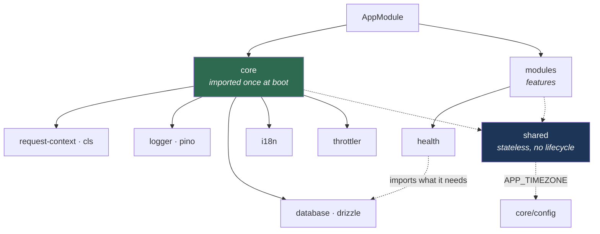
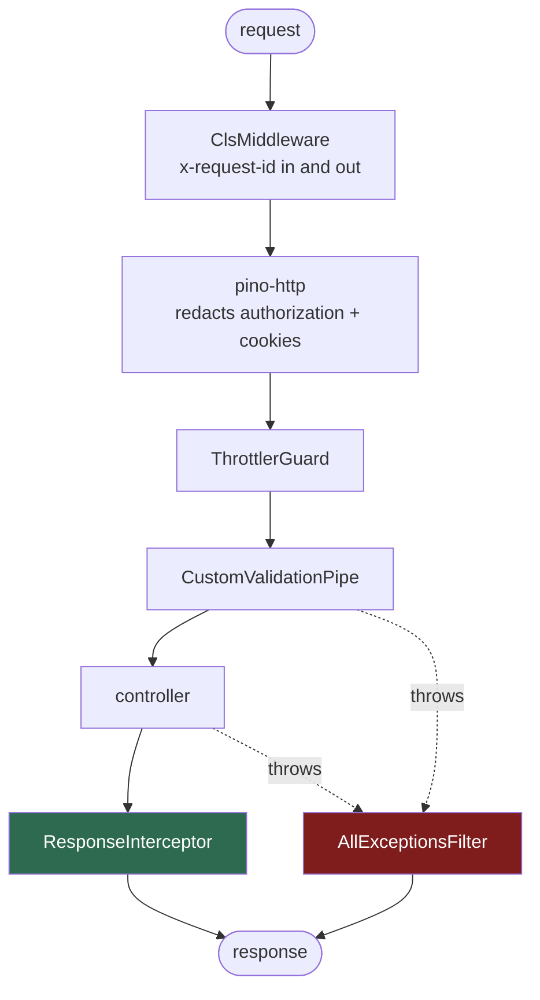

# api

NestJS 12 on the Express platform, with Drizzle, Pino and zod.

- [Layers](#layers)
- [Scripts](#scripts)
- [Configuration](#configuration)
- [Request pipeline](#request-pipeline)
- [Validation](#validation)
- [Feature modules](#feature-modules)
- [Database](#database)

---

## Layers

Three layers under `src/`, each reached through a path alias rather than long relative
paths.



```
src/
  main.ts
  app.module.ts
  app.controller.ts

  core/            imported once at boot; app-wide singletons
    config/        getEnv() (envalid), CORS, helmet, Swagger
    database/      drizzle + postgres.js, and only the connection
    i18n/          nestjs-i18n + the lang catalogues
    logger/        nestjs-pino, redaction, request-id correlation
    request-context/  nestjs-cls, the x-request-id header
    throttler/     rate limiting

  shared/          stateless; importable from anywhere
    decorators/    Swagger response decorators, @RawResponse, @ResponseMessage
    exceptions/    ApiException
    filters/       AllExceptionsFilter
    interceptors/  ResponseInterceptor
    pipes/         the zod validation pipe
    types/
    utils/         DateUtils, StrUtils, NumberUtils
    response.ts    the success/error envelope

  modules/         features
    health/
```

| Alias | Path |
| --- | --- |
| `@core`, `@core/*` | `src/core` |
| `@shared`, `@shared/*` | `src/shared` |
| `@modules/*` | `src/modules/*` |

```ts
import { successResponse, DateUtils } from "@shared"
import { getEnv } from "@core/config"
import { CoreModule } from "@core"
```

`nest build` plus `tsc-alias` rewrite these to relative paths, so nothing extra is
needed at runtime.

**The rule for the two non-feature layers:** `core` is what the app needs exactly once,
and `AppModule` imports it once. `shared` is stateless and carries no lifecycle, so
anything may import it freely. A feature never imports `CoreModule` — it imports the
specific module it needs (`DatabaseModule` for the connection) so its dependencies read
off its own file.

`shared/utils` does reach back into `@core/config` — `DateUtils` reads `APP_TIMEZONE`.
That is the one dependency crossing the layers, and it only goes one way.

There is no `libs/` directory. Nothing here is Nest-free enough for `apps/web` to
import, so it stays in the app — promote a directory to `packages/` once something
outside the API needs it.

---

## Scripts

```bash
bun run dev
bun run build
bun run start:prod
bun run typecheck
```

| Script | Does |
| --- | --- |
| `dev` | `nest start --watch` |
| `build` | `nest build`, then `tsc-alias` over `tsconfig.build.json` → `dist/` |
| `start:prod` | `node dist/main` |
| `db:generate` | Diff the schema into a migration under `drizzle/` |
| `db:migrate` | Apply pending migrations |
| `db:check` | Verify migrations against the schema |
| `db:studio` | Drizzle Studio |

Lint and format are Biome, run from the repo root: `bun run check:fix`.

---

## Configuration

Every variable is declared and validated in `src/core/config/env.ts` and read through
`getEnv()`. A malformed value fails at boot, not on the first request.

Copy `.env.example` to `.env` to start. `DATABASE_URL` is the only variable without a
development default — the app exits at boot without it.

Set `API_DOCS_ENABLED=true` to mount the Scalar API reference at `/docs`.

---

## Request pipeline

Nothing in a handler deals with envelopes, request ids or translation. That is all
wired globally in `CoreModule`.



**`ResponseInterceptor`** wraps whatever a handler returns in
`{ success, message, data }`, resolving the message through `nestjs-i18n`. Two opt-outs:

| Decorator | Effect |
| --- | --- |
| `@ResponseMessage("message.some.key")` | Use that catalogue key instead of `message.common.success` |
| `@RawResponse()` | Skip the envelope entirely — used by `HealthController`, whose Terminus body orchestrators already understand |

A handler that returns `successResponse(...)` itself is left alone.

**`AllExceptionsFilter`** catches everything, maps the status to an `ErrorCode`, and
resolves the message in the request language. On 5xx it attaches the request id to the
body and logs the error against it. On 5xx only, `API_DEBUG_ERRORS` also adds the
raw message and a stacktrace array — 4xx bodies never carry one.

Throw `ApiException` when you want to name the code yourself:

```ts
throw new ApiException(409, {
  code: errorCodes.conflict,
  messageKey: "message.users.email_taken",
})
```

---

## Validation

DTOs are zod schemas wrapped in `createZodDto` from `nestjs-zod`:

```ts
const CreateUserSchema = z.object({
  email: z.email(),
  age: z.number().int().min(18),
})

export class CreateUserDto extends createZodDto(CreateUserSchema) {}

@Post()
create(@Body() body: CreateUserDto) {
  return this.users.create(body)
}
```

The globally registered `CustomValidationPipe` parses the schema and, on failure,
returns `422` with a `{ field: [messages] }` map. Messages resolve against
`src/core/i18n/lang/<lang>/validation.json` in the request language; a message set on
the schema itself wins over the catalogue.

Schemas shared with the web carry `validation:`-prefixed keys instead of literal strings
— see [i18n](../../docs/i18n.md#shared-validation-messages).

---

## Feature modules

A feature owns everything it needs, in one directory:

```
src/modules/users/
  users.module.ts
  users.controller.ts
  users.service.ts
  users.repository.ts
  users.schema.ts
  dto/
    create-user.dto.ts
```

Persistence stays next to the feature that owns it — no central repository tree, so one
change touches one directory.

---

## Database

`src/core/database` holds the connection and nothing else: a `postgres.js` pool wrapped
in Drizzle, provided under the `DRIZZLE` symbol, closed on shutdown.

```ts
@Module({ imports: [DatabaseModule] })
export class UsersModule {}

@Injectable()
export class UsersRepository {
  constructor(@Inject(DRIZZLE) private readonly db: DrizzleDatabase) {}
}
```

Casing is `snake_case` in both the runtime config and `drizzle.config.ts`, so TypeScript
stays camelCase and the database stays snake_case without per-column mapping. With
`LOG_LEVEL=debug`, every statement is logged.

`DatabaseHealth` probes the connection for `GET /health`.

> [!NOTE]
> `database.schema.ts` is still empty and there is no `drizzle/` directory yet. Table
> definitions belong next to their feature (`users.schema.ts`), re-exported from
> `database.schema.ts` so `drizzle-kit` and the typed `db` client both see them.
> Migrations are not part of the runtime image — see
> [deployment](../../docs/deployment.md#gotchas).
