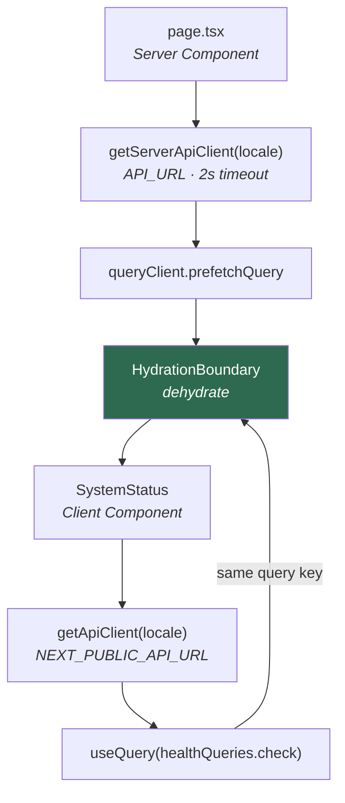

# web

Next.js 16 on the App Router, with React 19 Server Components, TanStack Query, Paraglide
and Tailwind v4.

There is no backend-for-frontend. The browser calls the API directly; the only route
this app serves itself is `/healthz`.

- [Layout](#layout)
- [Scripts](#scripts)
- [Environment](#environment)
- [Data fetching](#data-fetching)
- [Locale](#locale)
- [Theme and styling](#theme-and-styling)
- [Adding a page](#adding-a-page)

---

## Layout

Config files stay at the app root, all application code lives under `src/`, and `@/*`
maps to `./src/*`.

```
messages/<locale>/    Translation catalogues, one JSON per namespace
project.inlang/       inlang project settings
src/
  app/
    layout.tsx        Fonts, metadata, Providers, SiteShell
    page.tsx          The one page
    healthz/route.ts  Liveness, force-dynamic
  components/         App-owned components; primitives live in @workspace/ui
  hooks/
  lib/
    api/client.ts     Memoised clients, one per locale per side
    env.ts            Zod-parsed NEXT_PUBLIC_API_URL and API_URL
    i18n/client.tsx   LocaleProvider and useLocale() for Client Components
    i18n/header.ts    The header proxy.ts hands the locale over in
    i18n/server.ts    getServerLocale(), which sets the per-request locale
    paraglide/        Generated, git-ignored, never edited by hand
    query/client.ts   QueryClient factory
    typography.ts     Shared class strings
  proxy.ts            Detects the locale, forwards it, persists the cookie
```

---

## Scripts

| Script | Does |
| --- | --- |
| `dev` | `next dev` |
| `dev:i18n` | Paraglide compiler in watch mode |
| `build` | Compile messages, then `next build` |
| `start` | `next start` |
| `typecheck` | Compile messages, then `tsc --noEmit` |
| `i18n` | Compile messages once |

Run them through the root — `bun run dev` starts `dev` and `dev:i18n` together, wired by
the `with` option in `turbo.json`. Lint and format are Biome from the repo root.

Message compilation is a prerequisite of everything: `src/lib/paraglide/` is generated
and git-ignored, so a fresh clone fails to typecheck until `i18n` has run once. That is
why `build` and `typecheck` both call it first.

---

## Environment

Two variables, parsed by zod in `src/lib/env.ts` and cached after the first read.

| Variable | Read | Notes |
| --- | --- | --- |
| `NEXT_PUBLIC_API_URL` | Build time | Inlined into the client bundle. The image is environment-specific — pass it as a `--build-arg` |
| `API_URL` | Per request, server only | Where Server Components send requests. Optional; falls back to `NEXT_PUBLIC_API_URL` |

`publicApiOrigin()` and `apiOrigin()` return them with trailing slashes stripped. A
malformed value throws on first use rather than producing a broken request URL.

The split exists so server-side traffic can stay on an internal network — `API_URL` can
be `http://api:8000` while the browser uses a public hostname.

---

## Data fetching

Server Components prefetch, the browser takes over the same cache entry.



The two clients point at different hosts but share a `scope`, and the query key is built
from `scope` — so the hydrated result is reused instead of refetched on mount.

```tsx
const query = useQuery(healthQueries.check(getApiClient(locale)))
```

`getQueryClient()` makes a fresh `QueryClient` on the server and memoises one in the
browser. Defaults are a 30s `staleTime` and no refetch on window focus.

Errors are `ApiError` from `@workspace/client`. Branch on `error.kind` — `SystemStatus`
treats `network` and `timeout` as "unreachable" and everything else as a real answer.

---

## Locale

Locales are `en` (base) and `ko`. Resolution is cookie-first, then `Accept-Language`,
then the base locale; it never appears in the URL, so there is no `[locale]` segment.

`proxy.ts` detects the locale with Paraglide's `paraglideMiddleware` and forwards it as a
request header. Server Components call messages bare once their entry point has awaited
`getServerLocale()`:

```tsx
m["home.title"]()
```

Client Components take the locale from `useLocale()` and pass it per call:

```tsx
m["nav.theme"]({}, { locale })
```

The split, and why a Client Component cannot read the server's locale, is explained in
[i18n](../../docs/i18n.md#how-a-message-finds-the-locale).

Adding a locale, adding a namespace and the shared validation keys are covered in
[i18n](../../docs/i18n.md).

---

## Theme and styling

Primitives come from `@workspace/ui`, consumed as source via `transpilePackages` — no
build step.

```bash
bun run ui:add dialog
```

Run the shadcn CLI from this directory. It reads this app's `components.json`, sees the
`@workspace/ui` aliases, and writes the component into `packages/ui/src/components/`
while rewriting imports across the workspace boundary.

All CSS variables and `@theme inline` blocks live in
`packages/ui/src/styles/globals.css`, imported once in `layout.tsx`. There is no
`tailwind.config.js` — Tailwind v4 is CSS-first, and the `tailwind.config` field in
`components.json` is intentionally empty.

`next-themes` drives light/dark with `attribute="class"`, defaulting to system. Pressing
<kbd>d</kbd> outside a text field toggles it.

Repeated class strings that are not components live in `src/lib/typography.ts`.
`MICRO_LABEL` carries a `[&:lang(ko)]` override, because the mono-uppercase-tracked
treatment reads badly in Hangul.

---

## Adding a page

1. Create the route under `src/app/`.
2. Await `getServerLocale()` at the top of the page, and of its `generateMetadata` if it
   has one, then call messages bare.
3. Add copy to `messages/<locale>/<namespace>.json`; register a new namespace in
   `project.inlang/settings.json`.
4. Prefetch with `getServerApiClient(locale)` and wrap the client subtree in
   `HydrationBoundary` if it needs API data.

Server Components import icons from `@phosphor-icons/react/ssr`; Client Components use
`@phosphor-icons/react`.
