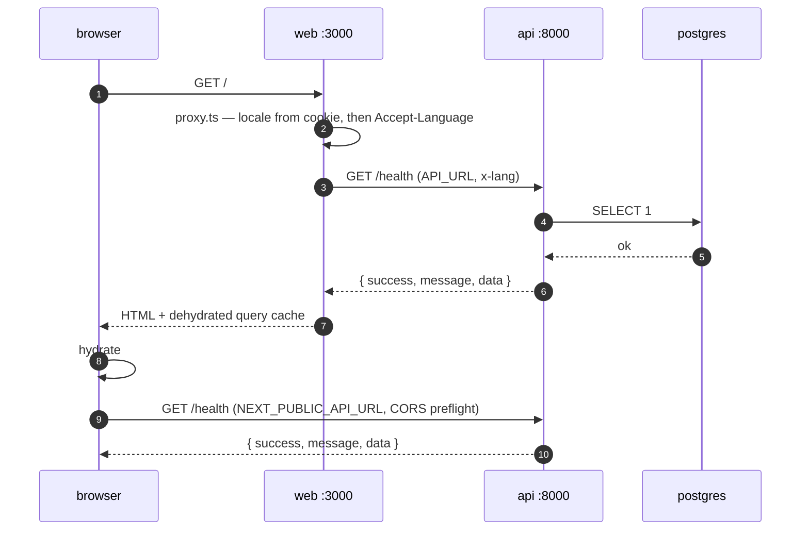
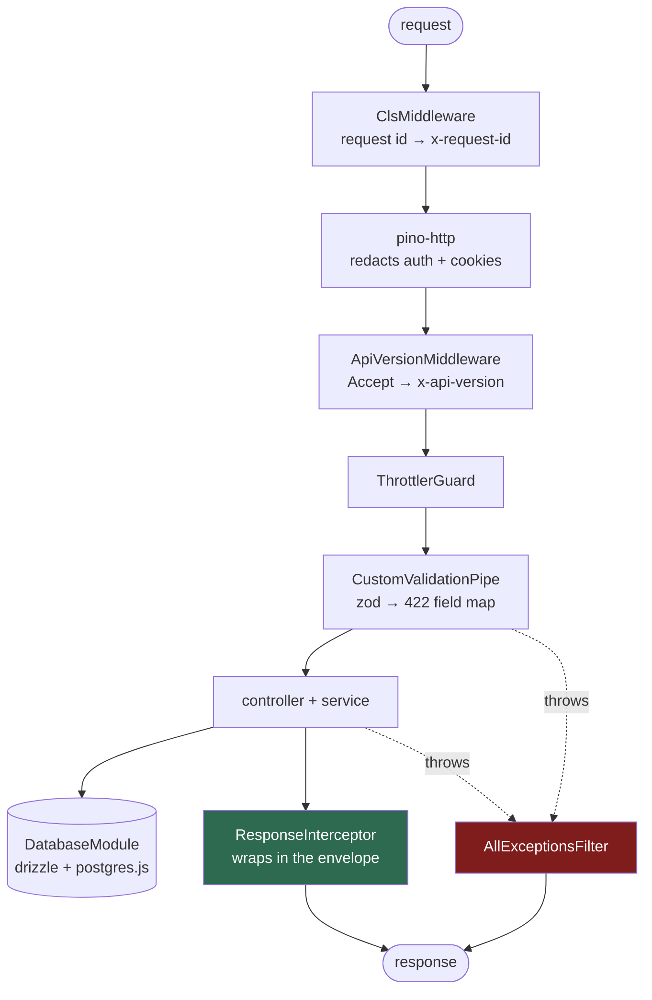

# Architecture

How a request travels, what it looks like on the wire, and the conventions that keep
the two apps in agreement.

- [Request flow](#request-flow)
- [API versioning](#api-versioning)
- [Response envelope](#response-envelope)
- [The API pipeline](#the-api-pipeline)
- [Calling the API from the web](#calling-the-api-from-the-web)
- [UI components](#ui-components)
- [Conventions](#conventions)

---

## Request flow

There is no backend-for-frontend. The browser reaches the API on its own origin, and
Server Components reach it over whatever address the cluster gives them.



The SSR prefetch and the browser refetch share a query key, so the hydrated cache is
reused rather than immediately refetched. That works because the key is built from the
client's `scope`, not its `baseUrl` — the two differ by design.

---

## API versioning

The version is negotiated through `Accept`, never through the path:

```http
Accept: application/json;v=1
```

The API answers with `x-api-version` and `Vary: Accept`. A request that names no version
gets the latest; a request that names one the API does not serve gets `406` with a
`NOT_ACCEPTABLE` envelope. `GET /` reports `apiVersion` and `apiVersions` so a client can
discover the range.

The media type, the `v` parameter and the response header are defined once in
`@workspace/schemas/http`, so both sides agree on the wire format. The list of versions
the API actually serves is the API's own business, in
`apps/api/src/core/versioning/versioning.constants.ts`.

`@workspace/client` sends the header from its `apiVersion` option; `apps/web` pins it, so
an API release cannot silently move the web app onto a new contract. Health endpoints are
version-neutral — orchestrators send `Accept: */*`.

Details, and how to add a version, in [`apps/api/README.md`](../apps/api/README.md#versioning).

---

## Response envelope

Every JSON response the API returns carries the same shape, defined once in
`@workspace/schemas/http` and used by both sides.

```json
{ "success": true, "message": "Success", "data": { } }
```

```json
{
  "success": false,
  "message": "Unprocessable Entity",
  "code": "VALIDATION_FAILED",
  "error": { "message": "…", "fields": { "email": ["…"] }, "requestId": "…" }
}
```

`code` is one of ten machine-readable values — `BAD_REQUEST`, `VALIDATION_FAILED`,
`UNAUTHORIZED`, `FORBIDDEN`, `NOT_FOUND`, `NOT_ACCEPTABLE`, `CONFLICT`,
`TOO_MANY_REQUESTS`, `INTERNAL_ERROR`, `SERVICE_UNAVAILABLE`. `requestId` is attached on
5xx only and matches
the `x-request-id` response header, so a user-reported error maps to a log line.

Health endpoints opt out with `@RawResponse()` — Terminus has its own well-known body
that orchestrators already understand.

---

## The API pipeline



`ResponseInterceptor` leaves a value alone if it already looks like an envelope, so a
handler may return `successResponse(...)` itself when it wants to set the message.
`AllExceptionsFilter` catches everything, maps the status to an error code, and resolves
the message through `nestjs-i18n` in the request language.

Layer rules, path aliases and how to add a feature module live in
[`apps/api/README.md`](../apps/api/README.md).

---

## Calling the API from the web

`@workspace/client` wraps axios with Zod-validated responses, envelope unwrapping, a
typed error union and the `x-lang` header. It also ships TanStack Query factories.

```tsx
const client = getApiClient(locale)
const query = useQuery(healthQueries.check(client))
```

`src/lib/api/client.ts` memoises one client per locale, one map for browser and one for
server:

| Factory | Base URL | Timeout |
| --- | --- | --- |
| `getApiClient(locale)` | `NEXT_PUBLIC_API_URL` | 10s default |
| `getServerApiClient(locale)` | `API_URL`, falling back to `NEXT_PUBLIC_API_URL` | 2s |

The short server timeout is deliberate: a slow API should degrade the page, not hold the
whole render open.

Full surface — error kinds, retries, adding a resource — in
[`packages/client/README.md`](../packages/client/README.md).

---

## UI components

Always run the shadcn CLI from `apps/web`. It reads that app's `components.json`, sees
the `@workspace/ui` aliases, and writes the component into `packages/ui/src/components/`
while rewriting imports across the workspace boundary.

```bash
bun run ui:add dialog
```

```tsx
import { Dialog } from "@workspace/ui/components/dialog"
import { cn } from "@workspace/ui/lib/utils"
```

`packages/ui` is consumed as source. `next.config.ts` sets
`transpilePackages: ["@workspace/ui", "@workspace/client"]`, so neither package has a
build step.

---

## Conventions

**Theme lives in one place.** All CSS variables and `@theme inline` blocks are in
`packages/ui/src/styles/globals.css`. Apps import it via `@workspace/ui/globals.css` and
share `packages/ui/postcss.config.mjs`.

**Both `components.json` files must agree** on `style`, `baseColor` and `iconLibrary`,
or the CLI emits mismatched components. `iconLibrary` is `phosphor`; Server Components
import from `@phosphor-icons/react/ssr`.

**Tailwind v4** — the `tailwind.config` field in `components.json` is intentionally
empty. There is no JS config file.

**Biome is a root task.** Turborepo recommends this over per-package lint tasks, since
Biome is fast enough that fan-out only adds overhead. Class sorting uses Biome's
`useSortedClasses` rule, replacing `prettier-plugin-tailwindcss`.

**No `@workspace/ui/*` path alias.** The base tsconfig sets
`moduleResolution: "Bundler"`, which honours the `exports` map in
`packages/ui/package.json` — the alias was redundant, and `@workspace/client` never had
one.

**`apps/web` uses the `src` folder convention.** Config files stay at the app root, all
application code lives under `src/`, and `@/*` maps to `./src/*`.

**TypeScript is not uniform, on purpose.** `apps/api` is on 6.x; the root, `apps/web`
and the packages stay on 5.9. TypeScript 7.0 (native Go compiler) is GA but ships without
a stable programmatic API until 7.1, and Next.js only gained a CLI-based TypeScript
backend in a 16.3 canary. Revisit once 7.1 lands.
