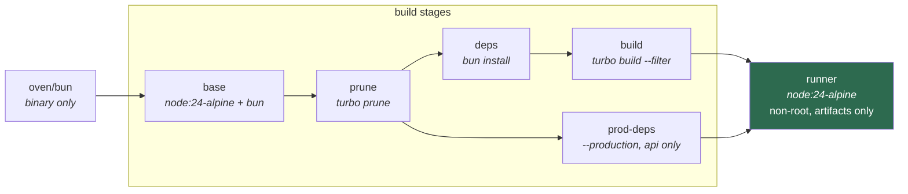

# Deployment

Two independent OCI images. Configuration is environment variables — there are no
provider SDKs and no platform adapters, so they run the same on a VM, ECS, Cloud Run,
Fly, Render, Nomad or Kubernetes.

- [Building](#building)
- [Environment variables](#environment-variables)
- [Health endpoints](#health-endpoints)
- [How the image builds work](#how-the-image-builds-work)
- [Gotchas](#gotchas)

---

## Building

The build context is the repo root, not the app directory.

```bash
docker build -f apps/api/Dockerfile -t workspace-api:1.0.0 .

docker build -f apps/web/Dockerfile -t workspace-web:1.0.0 \
  --build-arg NEXT_PUBLIC_API_URL=https://api.example.com .
```

Set `API_IMAGE` / `WEB_IMAGE` in `.env` to run prebuilt images from a registry instead
of building locally.

Images carry `org.opencontainers.image.*` labels. Pass `IMAGE_REVISION`,
`IMAGE_VERSION`, `IMAGE_CREATED` and `IMAGE_SOURCE` as build args to fill them in.

---

## Environment variables

### web

| Variable | Notes |
| --- | --- |
| `NEXT_PUBLIC_API_URL` | The API origin the browser calls. **Build-time** — pass it as a `--build-arg`, one image per environment. |
| `API_URL` | Where Server Components send requests. Read per request; falls back to `NEXT_PUBLIC_API_URL`. |
| `PORT` | Defaults to 3000. |

### api

| Variable | Notes |
| --- | --- |
| `DATABASE_URL` | **Required** — the process exits at boot without it. |
| `ALLOWED_ORIGINS` | Comma-separated web origins allowed to call the API. `*` is refused at boot outside development. |
| `APP_PORT` | Defaults to 8000. |
| `DATABASE_PREPARE` | Set `false` behind a transaction-mode pooler (PgBouncer, Supabase 6543). |
| `API_DOCS_ENABLED` | Mounts the Scalar API reference at `/docs`. Leave off in production. |
| `LOG_LEVEL` | `debug` logs every SQL statement Drizzle runs. |

Every variable is declared and validated in `apps/api/src/core/config/env.ts` — a
malformed value fails at boot, not on the first request. `apps/api/.env.example` lists
the rest.

### compose

`.env.example` at the repo root holds the compose-only variables. Copy it to `.env`
before `docker compose up`.

| Variable | Notes |
| --- | --- |
| `POSTGRES_USER` `POSTGRES_PASSWORD` `POSTGRES_DB` | Database credentials |
| `WEB_PORT` `API_PORT` | Published ports. The browser calls the API directly, so `API_PORT` must be reachable |
| `NEXT_PUBLIC_API_URL` | Baked into the web bundle. Changing it needs `docker compose build web`, not a restart |
| `API_PUBLIC_URL` | Becomes the API's `APP_URL` |
| `API_IMAGE` `WEB_IMAGE` | Set to pull prebuilt images from a registry instead of building locally |
| `API_DEBUG_ERRORS` | Puts the raw message and a stacktrace in error responses. Follows `NODE_ENV` when unset |

Per-app development config still lives in `apps/api/.env` and `apps/web/.env`.

---

## Health endpoints

| Endpoint | Purpose |
| --- | --- |
| `web /healthz` | Liveness |
| `api /health/live` | Liveness |
| `api /health` | Readiness — database + heap, `503` when degraded |

`HEALTHCHECK` is set on both images. Compose, ECS and Nomad use it; Kubernetes ignores
it in favour of its own probes — point those at the endpoints above.

---

## How the image builds work

Both Dockerfiles follow the same shape.



| Stage | Does |
| --- | --- |
| `prune` | `turbo prune <app> --docker` — cuts the monorepo to that app and its workspace deps |
| `deps` | `bun install --frozen-lockfile` from `out/json` only, so a source edit doesn't reinstall |
| `prod-deps` | The same install with `--production` (API only) |
| `build` | `turbo build --filter=<app>` over `out/full` |
| `runner` | `node:24-alpine`, non-root `node` user, artifacts only |

Bun is the package manager and runs the builds; the runtime is Node 24, because that is
what Nest and Next's standalone `server.js` are tested against. The bun binary is copied
out of `oven/bun` into `node:24-alpine`, so both tools exist in the build stages and
neither exists at runtime.

The web image ships Next's `output: "standalone"` build — a traced `server.js` plus only
the modules it actually reached, rather than the whole workspace `node_modules`. The API
image copies `apps/api/dist` and `packages/schemas/dist` over a production-only install.

---

## Gotchas

**`HOSTNAME` must be `0.0.0.0`** in the web image. Docker otherwise sets it to the
container ID, which Next tries to bind and fails.

**Postgres 18 moved its volume mount.** The single mount belongs at
`/var/lib/postgresql`, not `/var/lib/postgresql/data`. The old path leaves the container
unhealthy at startup.

**Migrations are not wired up yet.** `database.schema.ts` is empty and there is no
`drizzle/` directory. When the schema lands, add a migration step before the API starts
— `drizzle-kit` is a devDependency and is not in the runtime image.

**`turbo prune` respects `.gitignore`** (since turbo 2.3.4), and inlang generates a
`project.inlang/.gitignore` that ignores everything but `settings.json`. That is
survivable only because Paraglide's compile options are CLI flags in
`apps/web/package.json` rather than a config file in that directory. Move them into a
`paraglide.config.ts` and the file will not reach the build — Paraglide then silently
falls back to its default `outdir` and the Next build fails on unresolved
`@/lib/paraglide` imports.

**No `public/` directory** in `apps/web`, so the web Dockerfile does not copy one. Add
the `COPY` line if you add the directory.

**`serverExternalPackages` is unused**, and should stay that way for now: Next 16
Turbopack has open bugs where those modules are left out of the traced standalone
`node_modules`.
