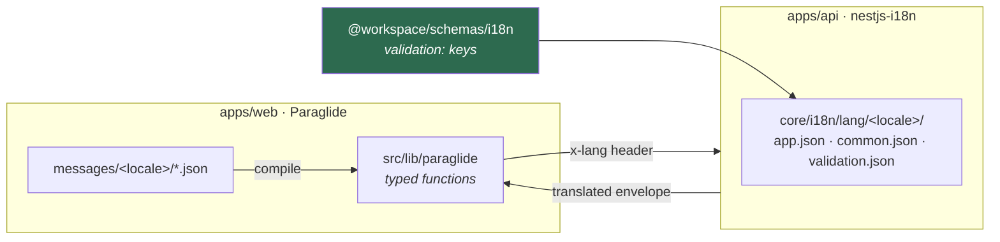
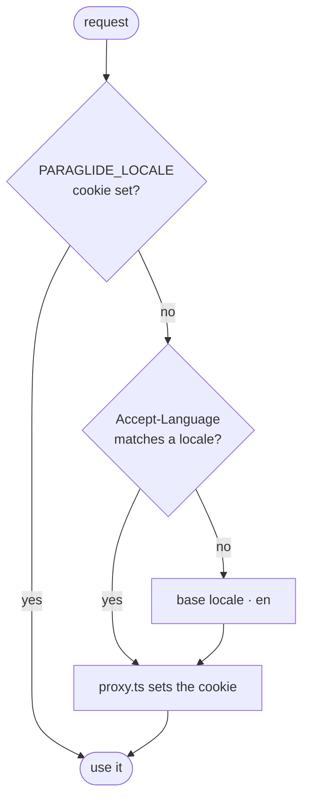

# Internationalisation

Two independent systems that agree on one thing: the locale travels in the `x-lang`
header.



The web owns its own copy; the API owns its own catalogues. They meet at the `x-lang`
header the client sends, and at the `validation:` keys a shared Zod schema carries.

- [Web — Paraglide](#web--paraglide)
- [API — nestjs-i18n](#api--nestjs-i18n)
- [Shared validation messages](#shared-validation-messages)

---

## Web — Paraglide

Locales are `en` (base) and `ko`, declared in `project.inlang/settings.json`. Copy lives
in `messages/<locale>/<namespace>.json` — one file per namespace (`app`, `nav`, `home`,
`status`, `stack`, `access`), each listed in the `pathPattern` of that settings file.
Paraglide compiles them into typed functions under `src/lib/paraglide/`, which is
generated and git-ignored.

Resolution is cookie-first, then `Accept-Language`, then the base locale. It never
appears in the URL, so there is no `[locale]` route segment.



`src/proxy.ts` only writes the cookie when it is missing or invalid; the
`locale-switcher` component overwrites it on demand.

### Adding a locale

1. Add it to `locales` in `project.inlang/settings.json`.
2. Add `messages/<locale>/` with one file per namespace.
3. Add a label to `LOCALE_LABELS` in `src/components/locale-switcher.tsx`.

### Why the locale is always passed explicitly

The locale is never held in global state. Server Components resolve it once with
`await getServerLocale()` (memoised per request with React `cache`), and every message
call names it: `m.some_key({}, { locale })`. Client Components take `locale` as a prop
and do the same.

`getLocale()` is synchronous and Next 16 exposes the request only asynchronously, so
there is no correct global for a Server Component to read — and a Client Component's
server-render pass has its own module graph anyway. Explicit locale is the only form
that is right in all three passes.

### Compilation is a script, not a plugin

Turbopack cannot run Paraglide's webpack plugin. `dev`, `build` and `typecheck` each run
`bun run i18n` first, and `turbo dev` additionally runs the compiler in watch mode via
the `with` option in `apps/web/turbo.json`.

The compile options are CLI flags on the `i18n` script rather than a
`paraglide.config.ts`. Keep them there — see the `turbo prune` note in
[deployment](deployment.md#gotchas).

---

## API — nestjs-i18n

Catalogues live in `src/core/i18n/lang/<locale>/` — one file per namespace, the same
shape the web uses: `app.json` (app copy), `common.json` (response messages) and
`validation.json` (field errors). The filename is the key prefix, so `common.json` is
read as `common.success`. Locales are `en` (fallback) and `ko`.

The request language is resolved in order, first match wins:

| Order | Source | Accepted names |
| --- | --- | --- |
| 1 | Query parameter | `?lang=` · `?locale=` |
| 2 | Header | `x-lang` · `x-custom-lang` |
| 3 | `Accept-Language` | any weighted list |
| 4 | Fallback | `en` |

Both names in each row are equivalent; the list lives in
`src/core/i18n/i18n.constants.ts`, and `cors.config.ts` unions the header names into the
CORS allow-list so a browser may send them cross-origin.

A client sends the header. `@workspace/client` sets `x-lang` from its `locale` option on
every request, so nothing at the call site has to think about it:

```ts
const client = createClient({ baseUrl, locale: "ko" })
```

The query parameter is for the places a header cannot reach — a pasted link, the browser
address bar, a Scalar "try it" call, a `curl` while checking a translation. It sits above
the header on purpose, so it overrides whatever a client already sends:

```bash
curl -H "x-lang: ko" http://localhost:8000/      # client
curl "http://localhost:8000/?lang=ko"            # by hand, and it wins over the header
```

A region tag falls back to its base locale through the `fallbacks` map (`ko-KR` → `ko`),
and an unknown language falls through to `en` rather than erroring.

`ResponseInterceptor` translates the success message, `AllExceptionsFilter` translates
the error message, and `CustomValidationPipe` translates each field error — all in the
resolved language, without a handler doing anything.

**Adding a locale:** add a folder beside `en` with the same namespace files, and list
it under `fallbacks` in `src/core/i18n/i18n.module.ts`.

---

## Shared validation messages

A Zod schema in `@workspace/schemas` is meant to run on both sides, so its messages
cannot be English strings. They are catalogue keys instead, tagged with a `validation:`
prefix by the `key()` helper:

```ts
export const accessRequestSchema = z.object({
  email: z
    .string()
    .trim()
    .min(1, key(accessMessages.emailRequired))
    .pipe(z.email(key(accessMessages.emailInvalid))),
})
```

On the API, `CustomValidationPipe` strips the prefix and looks the rest up under
`validation.<key>` in the request language. Issues raised by Zod itself — a missing
field, a bad format — are translated too, through a global `z.config({ customError })`
that maps the issue code to `validation.required`, `validation.format.email` and so on.

A message set on the schema wins over the catalogue default, and anything without the
`validation:` prefix passes through untouched.

Failures come back as `422` with a field map:

```json
{
  "success": false,
  "code": "VALIDATION_FAILED",
  "message": "Enter an email address.",
  "error": {
    "message": "Enter an email address.",
    "fields": { "email": ["Enter an email address."] }
  }
}
```

> [!NOTE]
> Nothing consumes `@workspace/schemas/access` yet. `AccessForm` declares its own local
> schema with Paraglide messages, because a client-side form needs the translated string
> immediately rather than a key the API would resolve. Share the schema once a form
> actually posts to the API — the pieces are in place for it.
