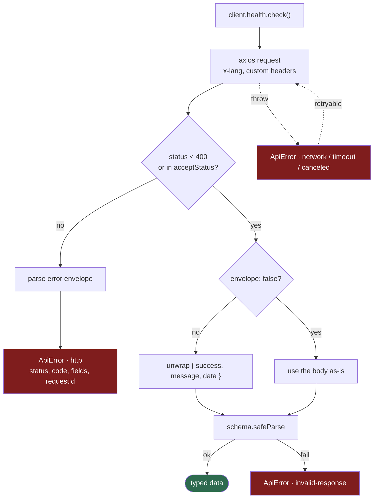

# `@workspace/client`

Typed HTTP client for the API. Axios underneath, Zod on the way out, one error type on
the way back.

Consumed as source — `apps/web` lists it in `transpilePackages`, so there is no build
step.

- [Usage](#usage)
- [What a call does](#what-a-call-does)
- [Errors](#errors)
- [TanStack Query](#tanstack-query)
- [Adding a resource](#adding-a-resource)
- [Options](#options)

---

## Usage

```ts
import { createClient } from "@workspace/client"

const client = createClient({ baseUrl: "http://localhost:8000", locale: "ko" })

const report = await client.health.check()
```

`locale` becomes the `x-lang` header on every request, which is what the API's
`nestjs-i18n` resolver reads — so error messages come back translated. The API also
accepts `?lang=` / `?locale=` and `Accept-Language`, but the header is the client's
transport; the query parameter is a manual override and outranks it — see
[i18n](../../docs/i18n.md#api--nestjs-i18n).

`client.with({ timeout: 2000 })` returns a new client with the same options and the
overrides applied.

In `apps/web`, use the memoised factories in `src/lib/api/client.ts` rather than calling
`createClient` directly:

| Factory | Base URL | Timeout |
| --- | --- | --- |
| `getApiClient(locale)` | `NEXT_PUBLIC_API_URL` | 10s |
| `getServerApiClient(locale)` | `API_URL`, falling back to `NEXT_PUBLIC_API_URL` | 2s |

---

## What a call does



The response schema is not decoration — a body the schema rejects raises
`invalid-response` rather than flowing into the UI as `undefined`. That is what makes
`@workspace/schemas` load-bearing rather than documentation.

`acceptStatus` lets a resource treat a non-2xx as data. `health.check` passes `[503]`,
because a degraded readiness report is a legitimate answer, not a failure.

---

## Errors

Everything thrown is an `ApiError`. The `kind` field is the discriminator:

| Kind | Means |
| --- | --- |
| `network` | The request never got an answer |
| `timeout` | It got no answer in time |
| `canceled` | An `AbortSignal` fired |
| `http` | The API answered with 4xx/5xx |
| `invalid-response` | The body did not match the schema, or was not an envelope |

```ts
try {
  await client.health.check()
} catch (error) {
  if (ApiError.isApiError(error) && error.kind === "http") {
    error.status
    error.code
    error.fields
    error.requestId
  }
}
```

`error.fields` is the `422` field map. `error.requestId` is set on 5xx and matches the
`x-request-id` response header, so a user-reported failure maps to a log line.
`error.retryable` is true for `network` and `timeout`.

Retries are automatic and conservative: GET only, 2 attempts, exponential backoff, on
network/timeout errors and `408 429 500 502 503 504`. Pass `retry: false` to disable, or
a `RetryOptions` object to widen it.

---

## TanStack Query

`@workspace/client/react` ships key builders and `queryOptions` factories. The peer
dependency is optional — importing the root entry never pulls React Query in.

```tsx
import { healthQueries } from "@workspace/client/react"

const query = useQuery(healthQueries.check(getApiClient(locale)))
```

Keys are `["api", client.scope, client.locale, ...]`. Building them from `scope` rather
than `baseUrl` is deliberate: the server client and the browser client point at
different hosts but share a scope, so a query prefetched during SSR hydrates the browser
cache instead of refetching on mount.

---

## Adding a resource

A resource is a factory over `RequestContext`. Register it and it appears on every
client, typed.

```ts
export function usersResource(context: RequestContext) {
  return {
    list: (query: PageQuery, options: RequestOptions = {}) =>
      context.fetch({ ...options, path: "/users", query, schema: usersPageSchema }),

    create: (body: CreateUser, options: RequestOptions = {}) =>
      context.fetch({
        ...options,
        path: "/users",
        method: "POST",
        body,
        schema: userSchema,
      }),
  }
}
```

```ts
export const resourceRegistry = {
  health: healthResource,
  users: usersResource,
} satisfies Record<string, ResourceFactory<unknown>>
```

Use `context.send` instead of `context.fetch` when there is no body worth parsing — it
still unwraps and still throws on failure, it just returns `void`.

---

## Options

| Option | Default | Notes |
| --- | --- | --- |
| `baseUrl` | — | Required. Trailing slashes are stripped |
| `scope` | `baseUrl` | Query-key namespace; set it to share a cache across hosts |
| `locale` | — | Sent as `x-lang` |
| `headers` | — | Object or a sync/async function, resolved per request |
| `timeout` | `10_000` | Milliseconds |
| `retry` | GET, 2 attempts | `false` to disable |
| `hooks` | — | `onRequest`, `onResponse`, `onError` |

Escape hatches, for when a resource is not worth writing: `client.$http` (the axios
instance), `client.$fetch` and `client.$send`.
