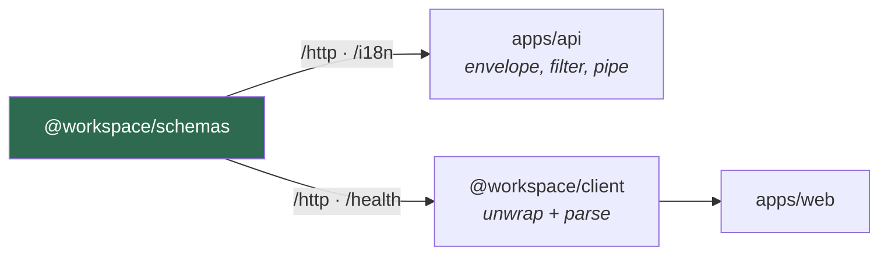

# `@workspace/schemas`

The contract between the API and the web app. Zod schemas, error codes and message keys
that both sides import, so a change to the wire format breaks the build rather than
production.

Built with tsup into ESM and CJS, because Nest needs CJS and Next needs ESM.

```bash
bun run build
bun run dev
```

- [Entry points](#entry-points)
- [The envelope](#the-envelope)
- [Error codes](#error-codes)
- [Pagination](#pagination)
- [Validation message keys](#validation-message-keys)
- [Adding a contract](#adding-a-contract)

---

## Entry points

| Import | Holds |
| --- | --- |
| `@workspace/schemas` | Everything, re-exported |
| `@workspace/schemas/http` | Envelope, error codes, pagination |
| `@workspace/schemas/health` | Health report and liveness |
| `@workspace/schemas/i18n` | The `validation:` key helpers |
| `@workspace/schemas/access` | The access-request schema and its message keys |

Prefer the subpaths. Each is a separate tsup entry, so importing `/http` in the API does
not drag the rest in.



---

## The envelope

Every JSON response the API returns has one of two shapes.

```json
{ "success": true, "message": "Success", "data": {} }
```

```json
{
  "success": false,
  "message": "Resource not found",
  "code": "NOT_FOUND",
  "error": { "message": "…", "fields": {}, "requestId": "…" }
}
```

| Export | Use |
| --- | --- |
| `successResponseSchema` | Parse a success body with an unknown `data` |
| `errorResponseSchema` | Parse an error body |
| `apiResponseSchema` | Discriminated union of both |
| `successResponseOf(schema)` | Success with `data` typed |
| `responseOf(schema)` | Union with `data` typed |

`error.fields` is the `422` field map, `error.requestId` is set on 5xx, and
`error.stacktrace` appears only when `API_DEBUG_ERRORS` is on.

The API builds these in `shared/response.ts`; `@workspace/client` parses them in
`core/request.ts`. Neither hand-writes the shape.

---

## Error codes

Nine values, mapped from HTTP status by `errorCodeForStatus`.

| Status | Code |
| --- | --- |
| 400 | `BAD_REQUEST` |
| 401 | `UNAUTHORIZED` |
| 403 | `FORBIDDEN` |
| 404 | `NOT_FOUND` |
| 409 | `CONFLICT` |
| 422 | `VALIDATION_FAILED` |
| 429 | `TOO_MANY_REQUESTS` |
| 500 | `INTERNAL_ERROR` |
| 503 | `SERVICE_UNAVAILABLE` |

Anything unmapped falls to `INTERNAL_ERROR` at 5xx and `BAD_REQUEST` below it. Branch on
the code, never on the message — the message is translated and will change.

---

## Pagination

```ts
import { pageQuerySchema, pageOf, page } from "@workspace/schemas/http"
```

`pageQuerySchema` parses `?page=&limit=` with a default of 20 and a ceiling of 100.
`pageOf(itemSchema)` builds the response schema; `page(items, meta)` builds the value.

---

## Validation message keys

A schema that runs on both sides cannot carry English strings, so it carries catalogue
keys marked with a `validation:` prefix.

```ts
import { key } from "@workspace/schemas/i18n"

export const accessRequestSchema = z.object({
  email: z
    .string()
    .trim()
    .min(1, key(accessMessages.emailRequired))
    .pipe(z.email(key(accessMessages.emailInvalid))),
})
```

`key()` adds the prefix, `isMessageKey()` tests for it, `unwrapMessageKey()` strips it.
The API's validation pipe unwraps and resolves each one against
`validation.<key>` in the request language; anything unprefixed passes through as a
literal.

Keys live beside their schema in a `*.keys.ts` file and are unioned into
`ValidationMessage` in `i18n/registry.ts`, so the type names every key the catalogues
must define.

---

## Adding a contract

1. Create `src/<name>/` with `<name>.schema.ts`, a `<name>.keys.ts` if it has messages,
   and an `index.ts`.
2. Re-export it from `src/index.ts`.
3. Add the entry to `tsup.config.ts` and the `exports` map in `package.json`.
4. If it has message keys, add them to `ValidationMessage` and to the API catalogues.

Keep it dependency-free apart from zod. Anything that imports Nest, React or Next
belongs in the app, not here.
